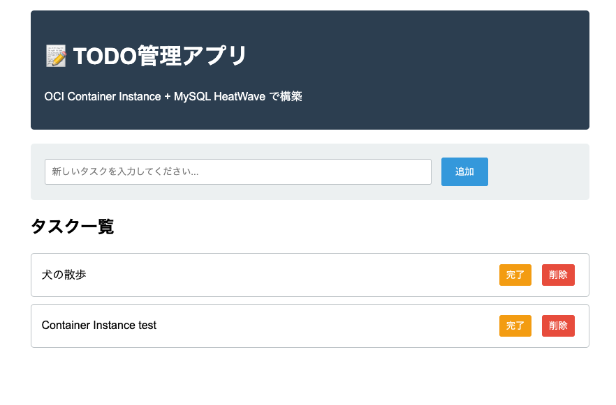

# oci-todo-mysql-demo

OCI 上の Kubernetes(OKE) や任意のコンテナ環境で動作する、シンプルな GUI 対応 TODO アプリ。




## 機能
- タスクの追加 / 完了切替 / 削除
- レスポンシブなシングルページ UI（サーバーサイドで HTML を返却）
- ヘルスチェック `/health`

## 構成
```
oci-todo-mysql-demo/
├── README.md
├── Dockerfile
├── requirements.txt
├── app.py
├── commands-container-instances.md  # Container Instances構築用コマンド集
└── commands-oke.md                  # OKE構築用コマンド集
```

## 事前準備（DB）
MySQL に `todos` テーブルを作成してください。

```sql
CREATE TABLE todos (
  id INT AUTO_INCREMENT PRIMARY KEY,
  title VARCHAR(255) NOT NULL,
  done TINYINT(1) NOT NULL DEFAULT 0,
  created_at TIMESTAMP DEFAULT CURRENT_TIMESTAMP
) CHARACTER SET utf8mb4;
```

## 環境変数
- `DB_HOST`: MySQL ホスト名
- `DB_USER`: MySQL ユーザー
- `DB_PASSWORD`: パスワード
- `DB_NAME`: データベース名

## ローカル実行（Docker）
```bash
docker build -t oci-todo-mysql-demo .

docker run --rm -p 8000:8000 \
  -e DB_HOST=your-mysql-host \
  -e DB_USER=your-user \
  -e DB_PASSWORD=your-password \
  -e DB_NAME=your-db \
  oci-todo-mysql-demo
```

- ブラウザ: `http://localhost:8000`
- ヘルスチェック: `http://localhost:8000/health`

## 構築手順コマンド集

本書「05-container-arai.re」で使用するコマンドをまとめたファイルです：

- **Container Instances用**: `commands-container-instances.md` - Container Instancesでの構築手順用コマンド集
- **OKE用**: `commands-oke.md` - OKE（OCI Kubernetes Engine）での構築手順用コマンド集

各ファイルには、構築時に実行するコマンドがセクションごとに整理されています。必要な値を置き換えて（`<xxx>`の部分）、順番に実行してください。
